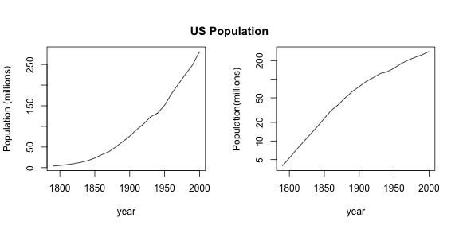
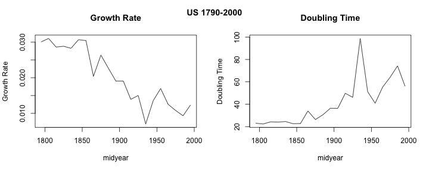

Growth Rates and Doubling Time -- KnitR Markdown Example 
========================================================
** J.M.Spicer (based on Rodríguez)

This is a example of reproducible research using Markdown and KnitR in RStudio.  Code chunks are interspersed with text that is rendered as html, but you don't use the standard html tags, there is a special subset of Markdown format commands.

You can Open the file in RStudio and execute the code chunks contained in the document by clicking "Chunks-->Run All" on the task bar. The data will be acquired, loaded and analyzed.  You re-execute and generate the document as an html page by clicking on the "Knit HTML" command on the task bar.  Upload to Angel, Google docs or get a free RPubs account to post your final product.

The data used in this example is from the U.S. Census Bureau population counts for the U.S. from 1790 to 2000, 


```r
# Read data from website, run this line alone as there may be a delay
uspop <- read.table("http://web.pop.psu.edu/~spicer/uspop.csv", header = TRUE)
attach(uspop)
```

We will plot the population in millions (otherwise we get bad labels) using absolute and log scales.

```r
pm <- pop/1e+06
```

You can also embed plots

```r
par(mfrow = c(1, 2))
plot(year, pm, type = "l", ylab = "Population (millions)")
# OR plot(year,log(pm), type='l')
plot(year, pm, log = "y", type = "l", ylab = "Population(millions)")
title(main = "US Population", outer = T, line = -3)
```

 


Growth Rates
------------
What was the growth rate in the last intercensal period? Let us list the population counts for the last two censuses. You can specify a format for Pop to insert commas.


```r
uspop$pop <- format(pop, big.mark = ",")
uspop[21:22, ]
```

```
##    year         pop
## 21 1990 248,709,873
## 22 2000 281,421,906
```

```r
pop[22] - pop[21]
```

```
## [1] 32712033
```

```r
pop[22]/pop[21] - 1
```

```
## [1] 0.1315
```

The population grew by 32,712,033 between 1900 and 2000. Take the ratio of the populations less 1 to obtain the rate.  So it grew 13.2\% in ten years. You'd think this is 1.32\% per year but that is only approximate because it forgets compounding the growth over the ten years.  If we compound k times per year a rate r we obtain Solving for r gives 

$$r = k[(P2000/P1990)^{(1/10k)}-1]$$

Here's the rate we obtain using different values of k (Note that you do not need to use a matrix language with R, it **is** a matrix language.)

```r
ratio <- pop[22]/pop[21]
k <- c(1, 2, 4, 6, 12, 52, 365)
r = k * (ratio^(1/(10 * k)) - 1)
print(cbind(k, r))
```

```
##        k       r
## [1,]   1 0.01243
## [2,]   2 0.01240
## [3,]   4 0.01238
## [4,]   6 0.01237
## [5,]  12 0.01236
## [6,]  52 0.01236
## [7,] 365 0.01236
```

here 1 means annual, 12 means monthly, and 365 means daily. We could continue compounding every minute, or every second, but you can see that our calculation is approaching a limit. From elementary calculus we know that as k -> infinity our equation becomes P2000=P1990 exp(10r), and solving for r gives log(P2000/P1990)/10 So the limiting value is


```r
log(ratio)/10
```

```
## [1] 0.01236
```

This, of course, is the mean annualized rate of growth. Note that we got the correct value rounded to five decimal places by the time we compounded monthly.

Growing more slowly
-------------------
We can now compute the growth rate for the entire story of the U.S. We treat all censuses as ten years apart, although this is not exactly true over time they have moved from August to June, and then April xcept for 1920, which was done in Januaryf you want to do a more precise calculation the dates are in the reference given at the top.


```r
growthrate <- c(NA, log(pop[-1]/pop[-22])/10)
```


Note the use of NA to refer to the first value of population. This generates a missing value for the very first row. Now we plot the rates over time. Because the rate pertains to the period between two censuses it makes more sense to plot it against the mid-point of the dates, which shifts the plot to the right 5 years.

```r
midyear <- c(NA, (year[-1] + year[-22])/2)
```

The graph is shown in the figure below, when we combine it with a plot of doubling time. We see that the growth rate declined steadily to reach a minumum in the 1930s, and has since hovered around the 0.9 to 1.7 percent range.

Doubling Time
-------------
At an instantaneous growth rate r, the doubling time is log(2)/r


```r
doub <- c(NA, log(2)/growthrate[-1])
par(mfrow = c(1, 2))
plot(midyear, growthrate, type = "l", main = "Growth Rate", ylab = "Growth Rate")
plot(midyear, doub, type = "l", main = "Doubling Time", ylab = "Doubling Time")
title(main = "US 1790-2000\n", outer = T, line = -3)
```

 

So the U.S. population was doubling every 22-24 years in the first half of the 19th century, but now it takes 56 years to double.

** Thanks to Germán Rodríguez for allowing me to replicate his excellent [Stata example] (http://data.princeton.edu/eco572/grdt.html) in R.
